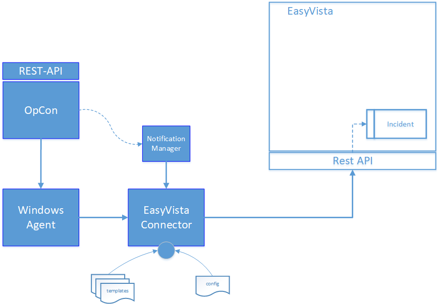
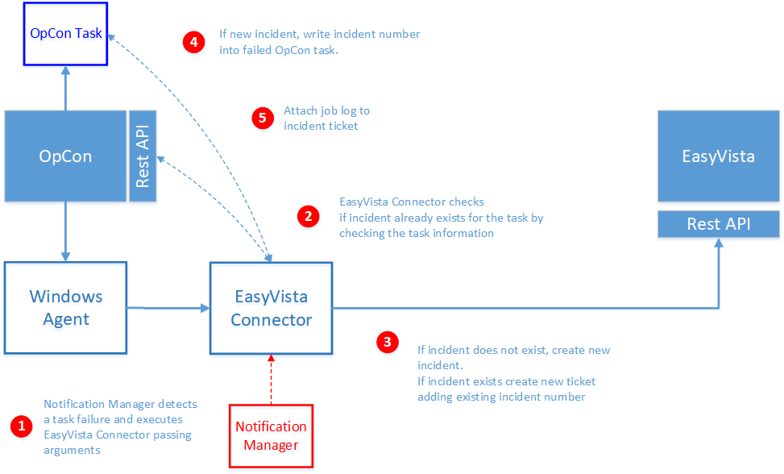

# EasyVista Connector overview

## What is it?

The EasyVista Connector is an OpCon connector that communicates with EasyVista through the EasyVista REST API to create incident tickets automatically when an OpCon job fails. It eliminates the need to manually open tickets for job failures and ensures that every failure is tracked with full context, including the job log.

Use the EasyVista Connector when you need to:

- Automatically open an EasyVista incident ticket whenever an OpCon job fails
- Attach the OpCon job log to the incident ticket for faster triage
- Write the EasyVista incident number back into the OpCon job's **Incident Ticket ID** field for traceability
- Route incident tickets to different EasyVista queues based on OpCon job tags

## Components

The OpCon EasyVista implementation uses the following components working together:

- **Notification Manager** — An OpCon feature that triggers the EasyVista Connector when a job encounters an error condition
- **Windows Agent** — An OpCon Windows Agent used to run the EasyVista Connector
- **EasyVista Connector** — The connector that communicates with EasyVista through the EasyVista REST API to create an incident
- **Config** — Defines the connection to the OpCon system
- **Templates** — Contains the EasyVista definitions to be used for each connection

## How it works

When a job fails in OpCon, the Notification Manager triggers the EasyVista Connector. The connector checks for an existing incident ticket, creates a new one if needed, and updates the OpCon job with the incident number.

To create an incident ticket, complete the following steps:

1. The EasyVista Connector is triggered by the Notification Manager when a failed job is detected. The Notification Manager uses the following OpCon global properties to pass information to the EasyVista Connector:

   | Property | Description |
   |---|---|
   | `$MACHINE NAME` | The name of the agent on which the job was running |
   | `$JOB TERMINATION` | The termination code of the job |
   | `$SCHEDULE DATE-EVIS` | A special version of the Schedule Date format created to support the EasyVista Connector |
   | `$SCHEDULE ID` | The schedule ID of the workflow in the OpCon system |
   | `$SCHEDULE INST` | The schedule instance of the workflow in the Daily OpCon table |
   | `$SCHEDULE NAME` | The name of the workflow |
   | `$JOB NAME` | The name of the job |

2. Before creating a new incident ticket, the EasyVista Connector checks whether an incident ticket has already been created for the job. The job information is extracted from the OpCon Daily Job table.
3. If an incident ticket exists, a new ticket is created. The previous ticket number is attached to the job documentation and the incident ticket description. When creating an incident ticket, the schedule name, the job name, the agent where the job was running, and the termination code are included in the incident description.
4. The returned incident number is written into the OpCon job in the **Incident Ticket ID** field. If there was an existing ticket and a new ticket was created, the previous ticket number is written into the job documentation field.
5. The EasyVista Connector calls the OpCon REST API to retrieve the job's job log and attaches it to the created or existing EasyVista incident ticket. The job log of the failed job can be accessed by selecting the file definition in the **Attachments** section of the created incident ticket.

## FAQs

**What happens if an incident ticket already exists for a failed job?**
The connector creates a new ticket and attaches the previous ticket number to the new ticket's description and to the job documentation field in OpCon.

**Can the incident ticket description be customized?**
Yes. The `DESCRIPTION` and `TITLE` values in the `Connector.config` file support customizable text using placeholder syntax. You can also use environment variables in the template file for more advanced customization. See [Installation](./installation.md) for configuration details.

**What OpCon version is required?**
The EasyVista Connector requires OpCon Release 21.0 or higher.

**Does the connector support multiple EasyVista instances?**
Yes. You can create multiple template files, each pointing to a different EasyVista instance. The template used for a given job is specified in the Notification Manager or AdHoc job configuration using the `-t` argument.

**Can specific jobs be excluded from creating tickets?**
Yes. When tag routing is enabled, you can define an `EXIT` tag in the template. If an OpCon job contains a matching tag, the connector exits without creating an incident ticket.

## Glossary

**EasyVista Connector** — The OpCon connector software that communicates with EasyVista through the EasyVista REST API to create and update incident tickets.

**Notification Manager** — An OpCon feature that monitors job statuses and triggers actions, such as running the EasyVista Connector, when a job fails.

**Incident ticket** — A record created in EasyVista that documents a job failure, including the job log, schedule name, job name, agent, and termination code.

**Template** — A JSON configuration file used by the EasyVista Connector that defines the connection to a specific EasyVista instance, the credentials, and the attributes to include in the incident ticket.

**Tag routing** — A feature that uses OpCon job tags to route incident tickets to different EasyVista queues or to suppress ticket creation entirely for specific jobs.

**`$SCHEDULE DATE-EVIS`** — A global OpCon property that stores the schedule date in `yyyy-MM-dd` format, required by the EasyVista Connector for date formatting.

**Related topics:**

- [Installation](./installation.md)
- [Operation](./operation.md)
- [Release Notes](./release-notes.md)
